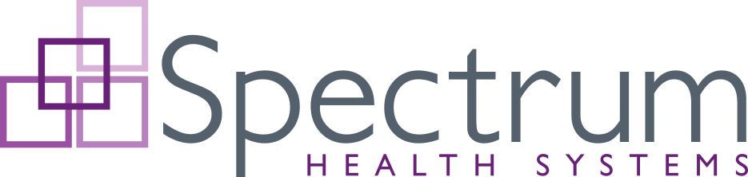

<!-- u240304 -->

 

This is the [Spectrum Health Systems](https://www.spectrumhealthsystems.org/) **public** GitHub profile, home to various open-source applications, tools, and utilities developed by Spectrum Health Systems.

# Projects

* [**Abatab**](https://github.com/spectrum-health-systems/Abatab)  
A custom web service for Netsmart's myAvatar™ EHR (***Development version***).

* [**Abatab Community Release**](https://github.com/spectrum-health-systems/Abatab-Community-Release)  
A custom web service for Netsmart's myAvatar™ EHR (***Public version***).

* [**Abatab Lieutenant**](https://github.com/spectrum-health-systems/AbatabLieutenant)  
A command line management utility for Abatab deployments.

* [**The Abatab Documentation Project**](https://github.com/spectrum-health-systems/Abatab-Documentation-Project)  
A living document for Abatab.

## Related projects

* [**The myAvatar Development Community**](https://github.com/myAvatar-Development-Community)  
Community-driven documentation, projects, and templates for Netsmart's myAvatar™ EHR.
