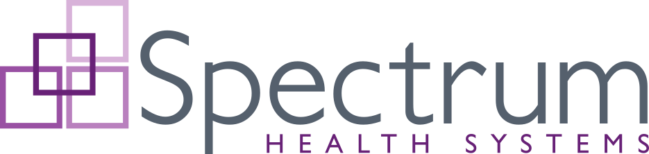

 

# Resources for Spectrum Health Systems repositories

Welcome to the Spectrum Health Systems public GitHub profile, which is the home to various open-source applications, tools, and utilities developed by Spectrum Health Systems.

# Projects

* [**Abatab**](https://github.com/spectrum-health-systems/Abatab)  
A custom web service for Netsmart's myAvatar™ EHR.

* [**Abatab Lieutenant**](https://github.com/spectrum-health-systems/AbatabLieutenant)  
A command line management utility for Abatab deployments.

# Documentation

* [XML Comment Standards](./Documentation/XmlCommentStandards.md)  
XML comment standards for Spectrum Health Systems projects.

* [Versioning](./Documentation/VersioningStandards.md)  
Versioning standards for Spectrum Health Systems projects.

* Our [Code of Conduct](../CODE_OF_CONDUCT.md) and [Contributing guidelines](../CONTRIBUTING.md)
